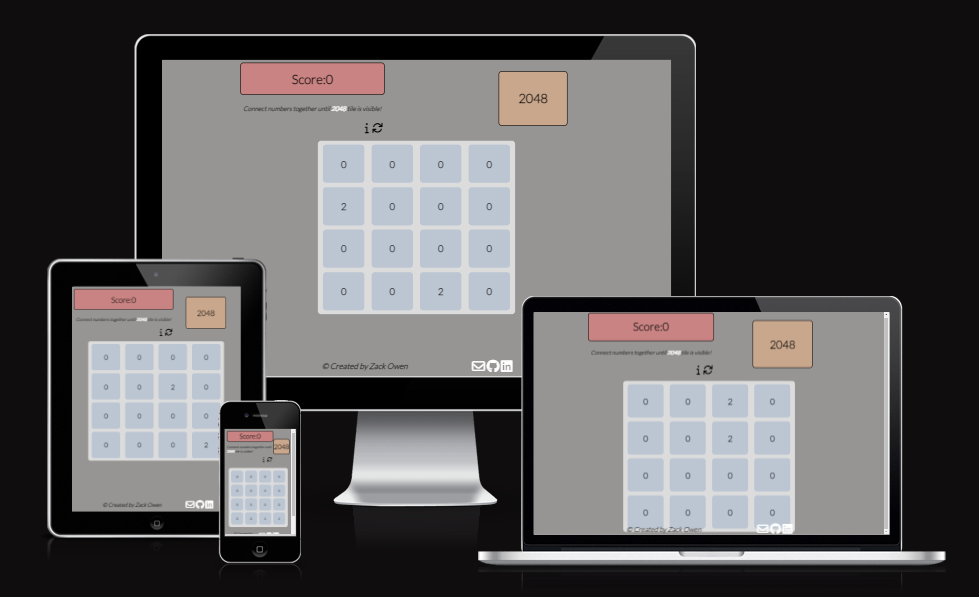

# 2048
(Developer: Zack Owen)

[Live webpage](https://deadenigma13.github.io/CI_PP2_2048/)

## Table Of Content

1. [Project Goals](#project-goals)
    1. [User Goals](#user-goals)
    2. [Site Owner Goals](#site-owner-goals)
2. [User Experience](#user-experience)
    1. [Target Audience](#target-audience)
    2. [User Requirements and Expectations](#user-expectations)
    3. [User Stories](#user-stories)
3. [Design](#design)
    1. [Design Choices](#design-choices)
    2. [Colour](#colours)
    3. [Fonts](#fonts)
    4. [Structure](#structure)
    5. [Wireframes](#wireframes)
4. [Technologies Used](#technologies-used)
    1. [Languages](#languages)
    2. [Frameworks & Tools](#frameworks-&-tools)
5. [Features](#features)
6. [Testing](#validation)
    1. [HTML Validation](#HTML-validation)
    2. [CSS Validation](#CSS-validation)
    3. [Accessibility](#accessibility)
    4. [Performance](#performance)
    5. [Device Testing](#performing-tests-on-various-devices)
    6. [Browser Compatibility](#browser-compatability)
    7. [Testing User Stories](#testing-user-stories)
8. [Bugs](#bugs)
9. [Deployment](#deployment)
10. [Credits](#credits)
11. [Acknowledgements](#acknowledgements)

## Project Goals

### User Goals
- Be able to understand the rules of the game and how to play
- Understand when the game has been won or lost
- Be able to restart the game easily without refreshing the website

### Site Owner Goals
- Deliver rules and information of the game
- Provide an easy but fun game
- Let users email to inform about potential bugs or improvements to the game
## User Experience

### Target Audience
- All ages of people
- Anyone who is looking for fun new game to play on the go or at home

### User Requirements and Expectations
- Allow users to indentify rules easily
- Quick easy way for users to contact the game owner
- Accessibility
- All provided information is easily readable on all screen sizes

### User Stories

#### First-time User
1. As a first-time user, I want to have an easy way of accessing the rules.
2. As a first-time user, I want to be able to restart the game without refreshing the website.
3. As a first-time user, I want to know if I have won or lost the game.
#### Returning User
4. As a returning user, I want to easily contact the game owner in case of any issues.
5. As a returning user, I want to find social media links to the site owners previous work.
#### Site Owner
6. As the site owner, I want users to contact about issues and bugs.
7. As the site owner, I want users to find all relative information easily.
## Design

### Design Choices
The webiste has been designed with accessibility in mind. Users with poor vision and for those who are colour blinded can still view and play the game without struggling to see the numbers on screen.

### Colour
The colours picked with accessibility for poor sighted users in mind, all colours picked are light with the text being mostly black so it stands out for all users.

### Fonts
Lato with sans serif as a fallback was used for headers and paragraphs on the page as the font complimented the colours well.

### Structure
The page is structured in a user friendly, easy to learn way so users who arrive on the site know exactly how to play the game and what buttons to press on both mobile and desktop.
The website contains only 2 pages:
- The main page in which the users play the game.
- Contact Us page with an email API.

### Wireframes

## Technologies Used

### Languages
- HTML
- CSS
- JavaScript

### Frameworks & Tools
- Git
- GitHub
- Gitpod
- Balsamiq
- Google Fonts
- Adobe Color
- Font Awesome
- Favicon.io

