# 2048
(Developer: Zack Owen)

[Live webpage](https://deadenigma13.github.io/CI_PP2_2048/)

## Table Of Content

1. [Project Goals](#project-goals)
    1. [User Goals](#user-goals)
    2. [Site Owner Goals](#site-owner-goals)
2. [User Experience](#user-experience)
    1. [Target Audience](#target-audience)
    2. [User Requirements and Expectations](#user-expectations)
    3. [User Stories](#user-stories)
3. [Design](#design)
    1. [Design Choices](#design-choices)
    2. [Colour](#colours)
    3. [Fonts](#fonts)
    4. [Structure](#structure)
    5. [Wireframes](#wireframes)
4. [Technologies Used](#technologies-used)
    1. [Languages](#languages)
    2. [Frameworks & Tools](#frameworks-&-tools)
5. [Features](#features)
6. [Testing](#validation)
    1. [HTML Validation](#HTML-validation)
    2. [CSS Validation](#CSS-validation)
    3. [Accessibility](#accessibility)
    4. [Performance](#performance)
    5. [Device Testing](#performing-tests-on-various-devices)
    6. [Browser Compatibility](#browser-compatability)
    7. [Testing User Stories](#testing-user-stories)
8. [Bugs](#bugs)
9. [Deployment](#deployment)
10. [Credits](#credits)
11. [Acknowledgements](#acknowledgements)

## Project Goals

### User Goals
- Be able to understand the rules of the game and how to play
- Understand when the game has been won or lost
- Be able to restart the game easily without refreshing the website

### Site Owner Goals
- Deliver rules and information of the game
- Provide an easy but fun game
- Let users email to inform about potential bugs or improvements to the game
## User Experience

### Target Audience
- All ages of people
- Anyone who is looking for fun new game to play on the go or at home

### User Requirements and Expectations
- Allow users to indentify rules easily
- Quick easy way for users to contact the game owner
- Accessibility
- All provided information is easily readable on all screen sizes

### User Stories

#### First-time User
1. As a first-time user, I want to have an easy way of accessing the rules.
2. As a first-time user, I want to be able to restart the game without refreshing the website.
3. As a first-time user, I want to know if I have won or lost the game.
#### Returning User
4. As a returning user, I want to easily contact the game owner in case of any issues.
5. As a returning user, I want to find social media links to the site owners previous work.
6. As a returning user, I want to know my current score.
#### Site Owner
7. As the site owner, I want users to contact about issues and bugs.
8. As the site owner, I want users to find all relative information easily.
9. As the site owner, I want users to find their way back to the game from the error 404 page.
## Design

### Design Choices
The webiste has been designed with accessibility in mind. Users with poor vision and for those who are colour blinded can still view and play the game without struggling to see the numbers on screen.

### Colour
The colours picked with accessibility for poor sighted users in mind, all colours picked are light with the text being mostly black so it stands out for all users.
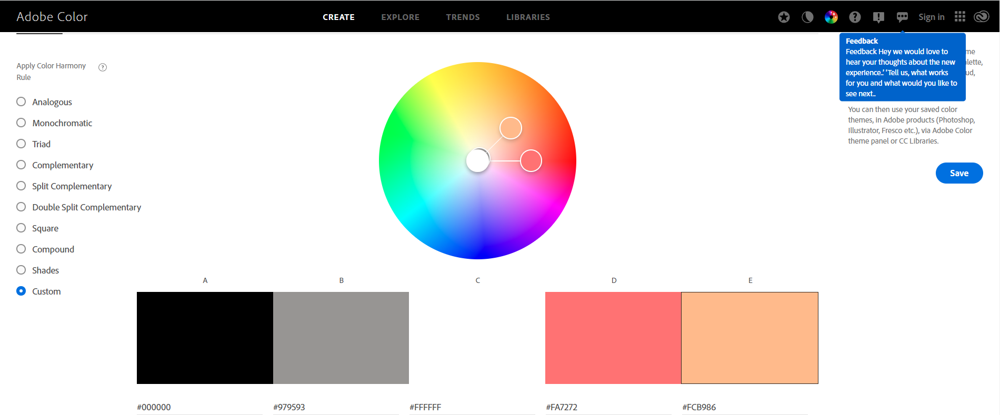

### Fonts
Lato with sans serif as a fallback was used for headers and paragraphs on the page as the font complimented the colours well.

### Structure
The page is structured in a user friendly, easy to learn way so users who arrive on the site know exactly how to play the game and what buttons to press on both mobile and desktop.
The website contains only 2 pages:
- The main page in which the users play the game.
- Contact Us page with an email API.

### Wireframes
The project templates and wireframes for The Feathered Duck Inn restaurant were designed using [Balsamiq](https://balsamiq.com/).

2048

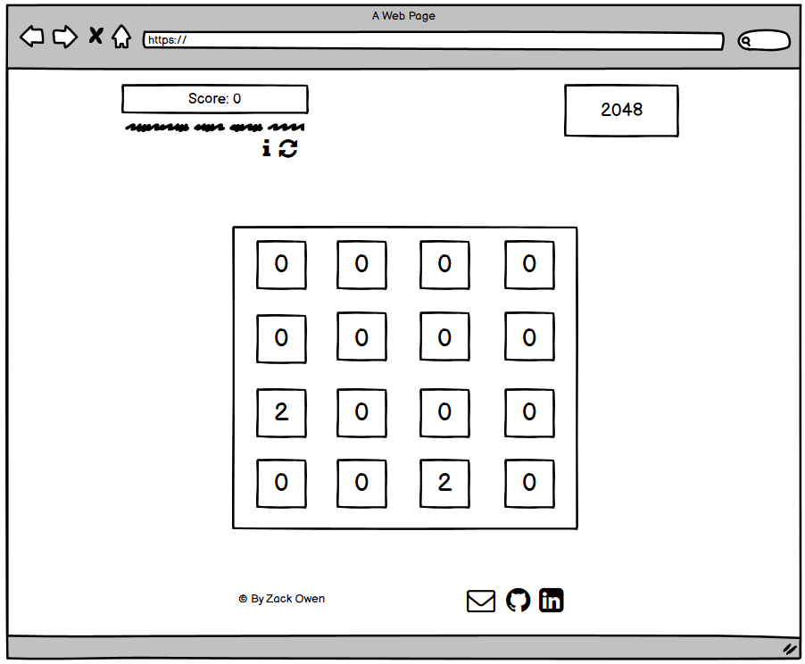
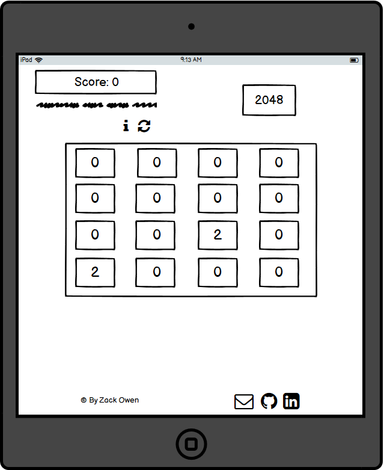
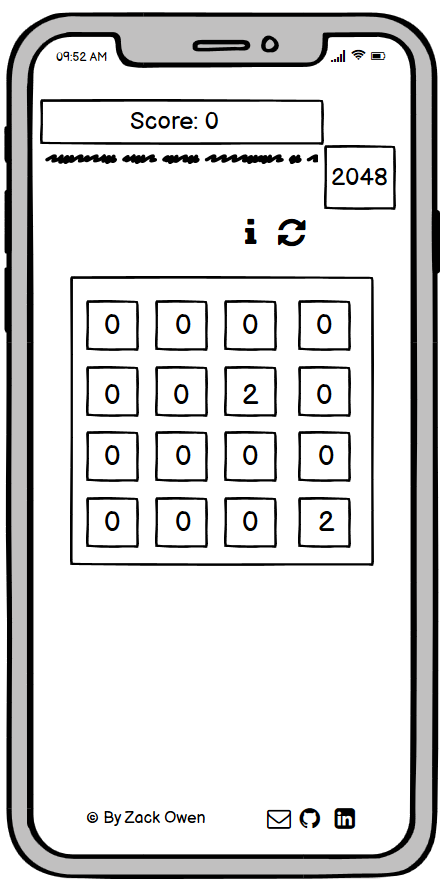

Contact

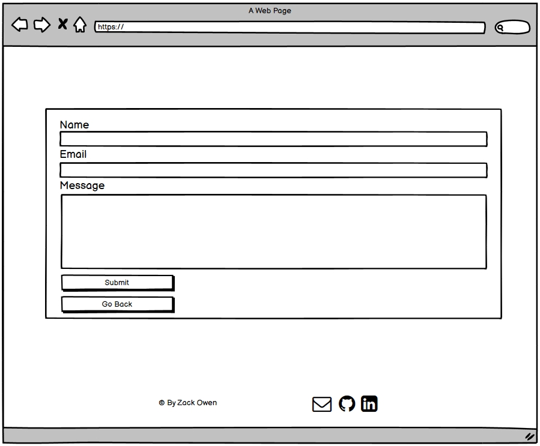

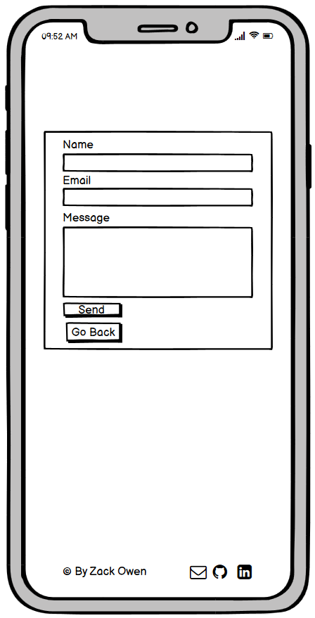

## Technologies Used

### Languages
- HTML
- CSS
- JavaScript

### Frameworks & Tools
- [Am I Responsive](http://ami.responsivedesign.is/) was used to create the multi-device mock-up you can see at the start of this README.md file.
- [Balsamiq](https://balsamiq.com/) to create the wireframes for the project
- [EmailJS](https://www.emailjs.com) used to send email from the contact form
- [Favicon.io](https://favicon.io) for making the site favicon
- [Font Awesome](https://fontawesome.com/) - Icons from Font Awesome were used throughout the site
- [Git](https://git-scm.com/) was used for version control within VSCode to push the code to GitHub
- [GitHub](https://github.com/) was used as a remote repository to store project code
- [Google Fonts](https://fonts.google.com/)
- [Chrome dev tools](https://developers.google.com/web/tools/chrome-devtools) were used for debugging of the code and check site for responsiveness
- [WC3 Validator](https://validator.w3.org/), [Jigsaw W3 Validator](https://jigsaw.w3.org/css-validator/), [JShint](https://jshint.com/), [Wave Validator](https://wave.webaim.org/), [Lighthouse](https://developers.google.com/web/tools/lighthouse/) and [Am I Responsive](http://ami.responsivedesign.is/) were all used to validate the website

## Features
The webpage consists of 2 pages and 7 features

### Title & Score
- The title and score can be seen at the top of the page
- The score is updated when a new tile is connected or entered the game board
- User stories covered: 6

### Gameboard
- Displays in the middle of the screen
- Shows current numbers in play
- User stories covered: 8

### Rules
- Rules are shown with the i button displayed above the gameboard
- Shown under the scoreboard
- User stories covered: 1

### Footer
- Shown at the bottom of every page
- Includes links to social media pages and email api
- User stories covered: 4, 5, 8

### Email enquiries
- Displayed at the bottom of the screen in the footer
- Sends user to a form screen, allows user to send enquiries about the game
- User stories covered: 4, 7, 8

### Result
- Result displays when the game decides if the user wins or loses
- Result shows above the gameboard after the game has been decided
- User stories covered: 3

### Restart
- Restart icon allows users to restart the game easily without refreshing the page
- Icon is displayed next to the rules icon below the score
- User stories covered: 6

## Validation
The W3C Markup Validation Service was used to validate the HTML of the website. All pages pass with no errors and only 1 error.

2048

Contact

### CSS Validation
The W3C Jigsaw CSS Validation Service was used to validate the CSS style of the website. When validating just my own custom CSS it passes with no errors and no warnings.

style.css

### JavaScript Validation
The JShint Validation Service was used to validate the JavaScript of the website. When validating it passes with no errors but 64 warnings which ES6/Mozilla JS extension warnings.

game.js

contact.js

### Accessibility
The WAVE WebAIM web accessibility evaluation tool was used to ensure the website met high accessibility standards. All pages pass with 0 errors.

2048

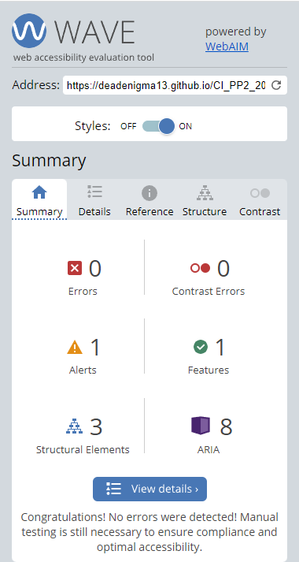

Contact

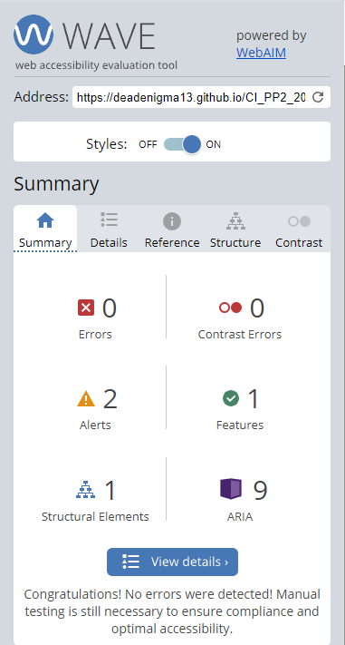

Error 404

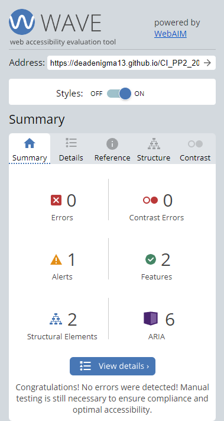

### Performance
Google lighthouse in Google Chrome Developer Tools was used to test the performance of the website.

2048

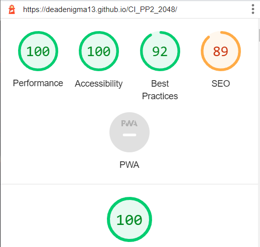

Contact

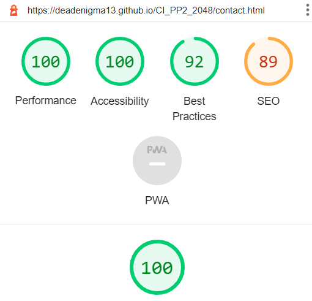

Error 404

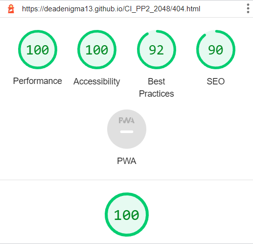

### Performing tests on various devices
The website was tested on the following devices
- Lenovo ThinkPad Pro Laptop
- Google Pixel 6 Pro
- Oppo Find X5 Pro
- Samsung Tablet

In addition, the website was tested using the Google Chrome Developer Device Toggling option for all available device options.

### Brower compatibility
The website was tested on the following browsers.
- Google Chrome
- Duck Duck Go
- Microsoft Edge

### Testing user stories

1. As a first-time user, I want to have an easy way of accessing the rules.

| **Feature** | **Action** | **Expected Result** | **Actual Result** |
|-------------|------------|---------------------|-------------------|
| Information icon | Navigate to the i icon | Opens up the rules for the game | Works as expected |

Screenshot

2. As a first-time user, I want to be able to restart the game without refreshing the website.

| **Feature** | **Action** | **Expected Result** | **Actual Result** |
|-------------|------------|---------------------|-------------------|
| Restart icon | Navigate to the refresh icon | Restarts the game and score | Works as expected |

Screenshot

3. As a first-time user, I want to know if I have won or lost the game.

| **Feature** | **Action** | **Expected Result** | **Actual Result** |
|-------------|------------|---------------------|-------------------|
| Game result | Play the game until win or loss | Depending on the game result, result shows outcome above the gameboard | Works as expected |

Screenshot

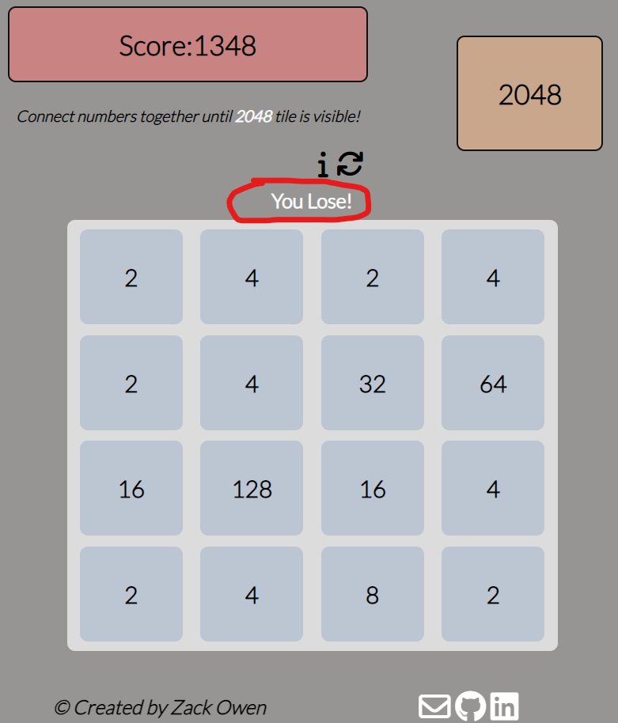

4. As a returning user, I want to easily contact the game owner in case of any issues.

| **Feature** | **Action** | **Expected Result** | **Actual Result** |
|-------------|------------|---------------------|-------------------|
| Email | Locate the footer, click on the email icon | Takes user to the email form screen | Works as expected |

Screenshot

5. As a returning user, I want to find social media links to the site owners previous work.

| **Feature** | **Action** | **Expected Result** | **Actual Result** |
|-------------|------------|---------------------|-------------------|
| Social Media Links | Locate the footer, click on the social media icons | Takes users to the site owners social media accounts | Works as expected |

Screenshot

6. As a returning user, I want to know my current score.

| **Feature** | **Action** | **Expected Result** | **Actual Result** |
|-------------|------------|---------------------|-------------------|
| Score | Score is shown at the top of the screen | Shows users their current score | Works as expected |

Screenshot

7. As the site owner, I want users to contact about issues and bugs.

| **Feature** | **Action** | **Expected Result** | **Actual Result** |
|-------------|------------|---------------------|-------------------|
| Email | Locate the footer, click on the email icon | Takes user to the email form screen | Works as expected |

Screenshot

8. As the site owner, I want users to find all relative information easily.

| **Feature** | **Action** | **Expected Result** | **Actual Result** |
|-------------|------------|---------------------|-------------------|
| Relative Information | All relative information is easily visible on the screen | Users can find all information easily | Works as expected |

Screenshot

9. As the site owner, I want users to find their way back to the game from the error 404 page.

| **Feature** | **Action** | **Expected Result** | **Actual Result** |
|-------------|------------|---------------------|-------------------|
| Error 404 | Click on the go back button to navigate back to the game | Users return back to the main game | Works as expected |

Screenshot

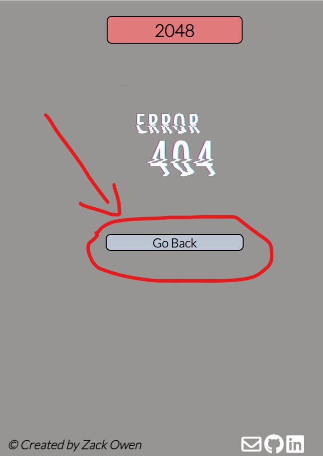

## Bugs

| **Bug** | **Fix** |
| ----------- | ----------- |
| The game result tells users they have lost despite possible moves still being available | Add return validMove function |
| Users could swipe in a diagonal direction and it the game would play a move | Add directional if statements for the game to check if user has moved diagonally and if so to not return a move |
| Users could continue the game even after 2048 tile showed | Add a checkForWin function and applied to combineRow/Column section |
| Score wouldn't display correctly when combining tiles | Added a scoreDisplay.innerHTML = score function and added to get elementbyId(score) |

## Deployment 
The website was deployed using GitHub Pages by following these steps:
1. In the GitHub repository navigate to the Settings tab
2. On the left hand menu select Pages
3. For the source select Branch: master
4. After the webpage refreshes automaticaly you will see a ribbon on the top saying: "Your site is live at https://deadenigma13.github.io/CI_PP1_TFDI/"

You can for fork the repository by following these steps:
1. Go to the GitHub repository
2. Click on Fork button in upper right hand corner

You can clone the repository by following these steps:
1. Go to the GitHub repository 
2. Locate the Code button above the list of files and click it 
3. Select if you prefere to clone using HTTPS, SSH, or Github CLI and click the copy button to copy the URL to your clipboard
4. Open Git Bash
5. Change the current working directory to the one where you want the cloned directory
6. Type git clone and paste the URL from the clipboard ($ git clone https://github.com/YOUR-USERNAME/YOUR-REPOSITORY)
7. Press Enter to create your local clone.

## Credits
Images not referenced below are owned by the developer.

### Media
Thanks to <a href="https://www.vectorstock.com/royalty-free-vector/game-over-glitch-vector-18841169">Vector Stock</a> for the error 404 image.

### Code
In order of appearance:
- 404 page was build using description on [GitHub Docs](https://docs.github.com/en/pages/getting-started-with-github-pages/creating-a-custom-404-page-for-your-github-pages-site)
- Credit to <a href="https://stackoverflow.com/questions/62823062/adding-a-simple-left-right-swipe-gesture">StackOverflow</a> for the information on how to make left right swipe gestures on mobile devices.

## Acknowledgements 
I would like to take this opportunity to thank:
- My mentor Mo Shami for his wonderful feedback, advice, guidance and support.
- My partner Chloe for her support, free time away from the child and understanding.
- Big shout out to Warwick Hart (@Wozza_5P) over in the Slack Community for the help and of course everyone else over in the Code Instiute slack community for their help, advice and support and providing peer reviews on my PP2 and peer code review.